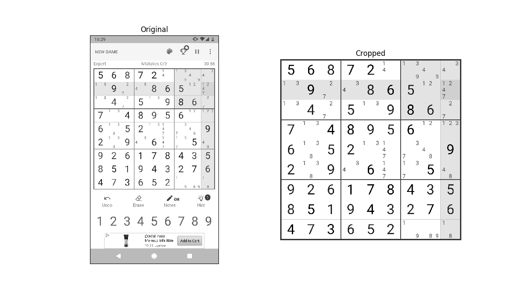

# Sudoku Board Finder

Given a screenshot of a sudoku board game like on [/r/sudoku](https://www.reddit.com/r/sudoku/), 
find the board and numbers on the board and return a link to a web sudoku solver like [sudokuwiki.org](sudokuwiki.org).

Example input:


Example output:

```
http://www.sudokuwiki.org/sudoku.htm?bd=150763009926005000307920561513072000600831057870500003200300045400050802705200006
```

# Board finder

`board_finder.py` contains the library for finding the sudoku board in a screenshot.




# Build instructions

This repo uses PIL (pillow), Opencv (opencv-python), and numpy, you can use virtualenv and pip to set up the environment.

If needed, install pip and virtualenv via:

```
python3 -m pip install --user --upgrade pip
python3 -m pip install --user virtualenv
```

Set up and activate a new virtualenv somewhere (such as your home directory)
```
python3 -m virtualenv env
source env/bin/activate
```

Install dependencies via:
```
sudo apt-get install libjasper-dev
sudo apt install libqt4-test
pip install -r requirements.txt
```


